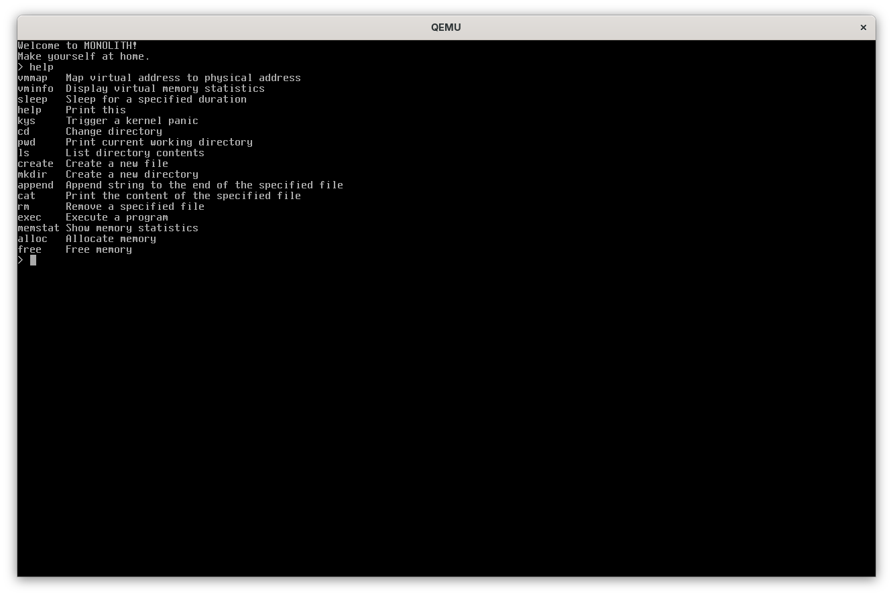
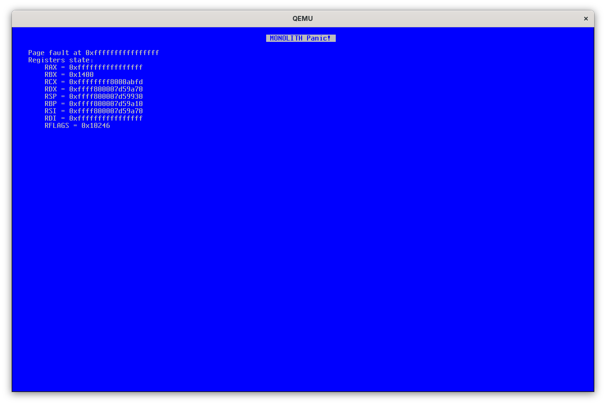

# MONOLITH

A WIP open source operating system with a focus on simplicity.

# Screenshots

|  |  |
| ------------------------------------ | ---------------------------------------------- |

# Documentation

- [Build instructions](docs/build.md)
- [Roadmap](docs/roadmap.md)
- [Contributing](docs/contributing.md)

# Credits

- [Limine](https://github.com/limine-bootloader/limine): A modern, advanced, portable and multiprotocol bootloader.
- [Flanterm by Mintsuki](https://codeberg.org/mintsuki/flanterm): A terminal emulator with support for multiple backends.
- [Unity by ThrowTheSwitch](https://github.com/ThrowTheSwitch/Unity/): A unit testing framework for C.
